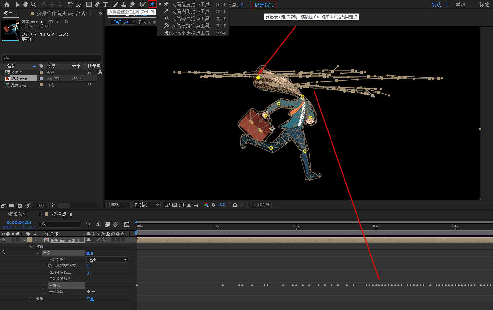

- 合成：指AE里的一个综合编辑对象，等级次于项目。  视频制作的工作空间，是后期输出视频的来源。

- 预合成：一种临时的图层链接，预合成内的全部效果依赖于预合成外的全部效果（类似于PR嵌套PS智能对象）。

- 新建文件夹可以对素材整理归类，在素材项目面板下有个新建文件夹按钮。

- 新建合成才可以编辑时间线，合成可以嵌套另一个合成。

- 菜单栏-效果 和 效果和预设独立面板是一样的

- 制作动画时通常从后向前退着作比较方便。

## 素材面板

- 右键素材——解释素材——主要——其他选项里可以设置素材循环播放的次数，通过此方法来延长素材时长同时速度保持不变。

## 时间轴面板
```
时间轴面板分为两大部分：图层控制区域及时间线区域。  

图层控制区域包括了三个主要窗格区：“图层开关”窗格、“转换控制”窗格、“入点/出点/持续时间/伸缩”窗格，可由左下角三个按钮来决定显示或隐藏。

按 F4 可切换“图层开关”和“转换控制”窗格。

按 Shift + F4 可显示或隐藏“父级和链接”列。
```  


- 图层控制区域由以下十三项组成，在列标题栏上右击选择“列数” Columns，即可选择隐藏或显示哪一列。  


# 图层

- 键盘上右侧的小数字键盘中按图层对应的数字即可选中相应的图层

- 按Backspace也可以删除图层

### 开关

- 消隐：在时间轴面板图层控制区域临时隐藏图层，以节省时间轴空间，但在合成画面里仍然存在并起作用。
	- 开启图层的消隐开关后要再点击消隐总开关来控制显示和隐藏。    

- 塌陷（两种作用）
	- 对于矢量层-连续栅格化：矢量图层上开启可以读取原始信息使其保持矢量图属性不失真。
	- 对于合成层-折叠变换：在预合成上开启可以读取里边素材的原始尺寸。

- 运动模糊
	- 开启该图层的运动模糊开关，再开启总开关。
	- 加强模糊方法
		1. 加快物体运动速度： 拖动单个关键帧调整速度或全选关键帧（点击属性）按住alt拖动首尾关键帧等比调整时间。
		2. 合成设置—高级—运动模糊—快门角度的数值（默认180，最高720），作用于整个合成的运动，运动速度不变。


### 变换

- 变换5大属性
	1. 缩放S
	2. 位置P
	3. 旋转R：星号前面是旋转圈数，星号后面是旋转角度
	4. 透明度T
	5. 锚点A：一般不用属性里的锚点去调整中心，而是用锚点工具Y去调整

- 单独属性重置在右键，变换旁边的重置可以把整体所有属性重置为原始状态
		
- 查看更多属性可按shift+属性快捷键

- 锚点工具（Y）：按住ctrl可以自动吸附对齐，按住ctrl双击锚点工具可重置为默认中心

- 制作水平反转效果：取消缩放属性的比例约束，单独对X坐标数值取反（正变负或负变正）。

- 大写灯：画面会停止刷新和显示状态，当然也不能更改。

### 关键帧

- 起始时间和原始属性到结束时间和属性变化；设置结束关键帧时先调整时间指示器，再改变属性；选择锚点工具点物体中心设置锚点，再点工具栏对齐让锚点自动吸附对齐锚点

- 关键帧可以复制粘贴到时间指示器所在位置上

- 临时插值调整运动匀速或变速，空间插值调整运动路径直线或曲线。

- 空间插值默认是自动贝塞尔曲线，要做直上直下的运动时改为线性。
	- 方法一：关键帧上右键-关键帧插值-空间插值
	- 方法二：钢笔工具组下转换顶点工具

- 等比缩放关键帧距离：全选关键帧，按住Alt拖动最后一个关键帧。

### 时间

- 时间反向图层：倒放

- 时间伸缩：整体快放或慢放

- 冻结帧：把时间指示器所在画面冻结成一张图，把整段视频变成那一帧静态图

- 时间重映射(Ctrl+Alt+T)：自动生成两端关键帧，通过关键帧调整视频的时间节点，来改变视频播放速度

### 图表编辑器（动画曲线）  


- 在图层开关区域，快捷键：Shift + F3
- Graph Editor提供了两种类型的图表，一种是用来显示属性值多少的值图表 Value Graph，一种是用来显示属性值变化速率的速度图表 Speed Graph。
- 在图表编辑器上调整关键帧，可让属性值的变化更自然、细腻、流畅，更方便模拟真实的物理运动效果。
- 显示速度曲线步骤
	1. 打开时间轴图表编辑器
	2. 选择带关键帧的属性
	3. 编辑区域右键——编辑速度图表（默认是编辑值图表）
- 点击图层某个属性才可编辑，按住ctrl键添加节点。
- 按ctrl点击时间线上的关键帧可变成匀速（菱形）关键帧
- 关键帧预设-缓动（缓入+缓出）（快捷键F9）可变成匀加速或匀减速，关键帧形状为沙漏

					
### 蒙版

- 蒙版是依附于图层存在的，是图层的下属属性。

#### 蒙版绘制方式（前提是先选中图层）
1. 形状工具：绘制过程中配合鼠标滚轮或键盘上下左右方向键调整形状，双击形状工具即可恢复默认形状。
2. 钢笔工具：Ctrl添加删除锚点

#### 蒙版属性
- 移动蒙版：选择工具双击蒙版路径边缘，点出定界框再移动或缩放，回车取消定界框。
- 调整蒙版：选择工具拖动蒙版路径锚点
- 蒙版路径：M
- 蒙版羽化：F
- 蒙版模式为无时只保留路径
- 添加两个或两个以上蒙版时第二个蒙版开始模式改为“相减”


### 轨道遮罩
- 在图层TrkMat选择，上形下图
- Alpha遮罩：下图（素材层）读取上层（遮罩层）的alpha通道信息
- 亮度遮罩：下图（素材层）读取上层（遮罩层）的亮度信息
- 选择完轨道遮罩，遮罩层自动被隐藏。
	
### 预合成（相当于PR嵌套PS编组）
```
Ae 不能对图层进行编组，若想将多个图层整合在一起，就需要通过预合成来实现。
预合成常用于组织和管理复杂的合成。
合成嵌套是指，将一个合成拖入到另一个合成中，作为它的一个图层。
```
#### 预合成的作用
1. 方便查找和管理：如果图层太多，可将一些图层合并为预合成。
2. 可在预合成中随意替换、添加或删除其中的图层。也就是说，方便对原始素材的二次修改 。
 相当于 Ps 中对智能对象的编辑处理。
3. 为预合成中的多个图层统一添加相同的效果。
4. 预合成可作为源素材被反复利用，且可同步更新。
5. 图层自身有变换属性，预合成也有变换属性，相当于又添加一组变换属性。比如，制作地球的自转和公转动画时，需要同时用到两个旋转属性。
6. 更改图层的默认渲染顺序：对于不能开启“折叠变换”的一般图层，默认情况下先渲染效果再渲染图层的变换属性。这样，效果可能将无法完整地应用到更改了变换属性的图层上。
对于预合成图层，启用“折叠变换”后，先渲染预合成图层的变换属性，再渲染为预合成图层添加的效果。
7. 有些素材需要转换为预合成后才能被识别利用，比如，让一个文本图层作为粒子发射器，就需要将文本图层进行预合成。

#### 创建方式
- 选中一个或几个图层右键-预合成，快捷键：Ctrl+Shift+C

#### 预合成选项
- 选项1：保留合成中的所有属性
	- 只能对一个图层作预合成
	- 合成尺寸与素材尺寸相同
	- 素材图层上原来的效果、属性关键帧及蒙版等都转移保留在预合成图层上
	- 一般用于模板制作

- 选项2：将所有属性移动到新合成
	- 新合成尺寸与上一级尺寸相同
	- 素材自身的特效一起被打包，动画等特效还在原来的图层上
	- 总合成整洁又可以统一添加效果或制作动画。例如地球的公转和自转，内层做自转，外层预合成做公转。


#### 两个选项区别

- 选项1只能作用于单个素材，而选项2单个或多个素材都可以
- 效果留在外面和留在里面的区别
- 产生的预合成尺寸不一样


#### 查看合成之间的嵌套关系

- 通过点击时间轴面板上方的“合成微型流程图”按钮，查看嵌套的合成之间的关系，快捷键：Tab
- 查看整体合成关系：时间轴面板右键-合成流程图
- 可点击流程上的合成名，快速切换合成。
- 通过面板控制菜单可更改流程方向与排序。

### 父子关系和链接

#### 作用和特点

- 父子级链接是用来绑定一些层的
- 父级控制子级，子级跟随父级，一个图层只能有一个父级，子级可以有多个
- 父级的运动变换（除了不透明度）都会被子级继承，但子级的运动是独立的（例如车身作为父级带动轮子，但轮子也可以自己转动而不带动车身），父级的效果是独立的不被继承。

#### 使用方法

1. 使用“父级关联器”给图层添加父级关系：鼠标按住“父级关联器”图标（螺旋纹），拖动到作为其父级的图层，作为本图层的父级
2. 使用“父级和链接”选框设置父级关系：在图层后面的“父级和链接”选框中，指定选择其他图层作为本图层的父级  

	

- 直接拖动父级关联器建立父子关系时，子图层的位置相对不变。但“位置”属性值会发生变化，因为此时它开始基于父图层坐标系而不再基于合成坐标系。  
- 拖动父级关联器时，加按 Shift 键可让子图层“跳跃”至父图层位置，即子图层的锚点与父图层的锚点重合。由于使用的是父图层坐标系，所以子图层的“位置”属性值即是父图层的“锚点”属性值。
- 拖动父级关联器时，加按 Alt 键也可以让子图层进行“跳跃”。子图层的“位置”属性值保持不变，但由于坐标系的转变，子图层将基于父图层的坐标系进行定位。

#### 解除父子关系

1. 在图层后面的“父级和链接”选框中选择 “ 无 ” None 或者 按 Ctrl 键点击子图层的父级关联器

- 这样会让子图层保持原来的画面位置不变，由于子图层的“位置”属性从父图层坐标系转变回合成坐标系，所以其值会有变化。

2. 按住 Ctrl + Alt 键并单击子图层的父级关联器可删除父级并使子图层跳跃。

- 由于子图层的“位置”属性从父图层坐标系转变回合成坐标系，所以会跳跃到合成坐标系对应的“位置”属性值。

#### 选择子项

- 如果想选中某个父级图层及其所有的子图层（包括子图层的子图层）， 选中父级图层右键-选择“ 选择子项 ” Select Children 。

#### 获得两套属性的方式

- 例如有时一个图层的位置属性要做独立的两种关键帧，一种是单独上下的位置变化、另一种是单独前后的位置变化。

1. 创建预合成：预合成有自己的独立属性，可以对一个或多个图层做统一操作

2. 创建空对象：通过父子关联器链接绑定到空对象，使用空对象的属性

**空对象**

- 负责调整运动的空图层
- 经常用于父子关系或控制摄像机

#### 使用技巧

- 将多个图层链接到空对象上，只需要对空对象进行操控即可。

### 路径动画(蒙版路径)

- 物体沿着路径而运动
- 操作流程
	1. 新建纯色层用钢笔工具绘制蒙版
	2. 按M调出蒙版路径复制
	3. 粘贴到作运动的图层位置属性上
	4. 调整运动方向：图层右键——变换——自动定向（Ctrl+Alt+O）——沿路径定向
	5. 素材本身方向不准用旋转属性调整


---

## 形状图层（多用于MG动画）

### 创建方式

1. 形状工具（Q）或钢笔（G）

	- 不选中任何图层（可以先按F2），直接使用形状工具或钢笔工具在合成查看器面板上绘制。
	- 选中形状图层继续绘制，可以在同一个形状图层内容里添加多个形状。

2. 菜单-图层-新建-形状图层，或者，在时间轴面板上右击选择“新建-形状图层”，可以新建空白形状图层。
	
	- 默认内容为空
	- 使用形状工具或钢笔工具在查看器面板上绘制。
	- 也可以在图层面板上展开形状图层，点击“内容”同行右侧“添加”组件进行组合（工具栏上的“添加”也一样）。

- 特点
	- 在选中某个非形状图层时绘制，绘制的形状将变成该图层的蒙版。
	- 要绘制形状到一个已有的形状图层上作为组件，应先选定这个形状图层。
	- 双击形状工具，可创建合成大小的蒙版或形状。
	- 使用选取工具移动形状图层时，如果没有勾选工具选项栏的“对齐” Snapping，可按住 Ctrl 键自动对齐。 
	- 默认情况下，形状图层的锚点位于合成的中心。  
	
	**一般情况会开启“首选项-常规-在新形状图层上居中放置锚点”选项，因为 Ae 会以锚点为参考点来改变图层的位置、缩放或旋转属性。**
	
- 绘制基础形状常用操作
	
	- 加按 空格 键或鼠标中键：可改变形状位置。
	- 加按 Shift 键：可绘制正圆或正方形。
	- 加按 Ctrl 键，以点击位置为中心绘制形状。
	- 加按 Ctrl + Shift 键，以点击位置为中心绘制正圆或正方形。
	- 绘制圆角矩形时，不松开鼠标的同时按 ↑ 键或 ↓ 键可增加或减小圆度 Roundness，或使用鼠标滚轮。按 ← 键将圆度调为最小，按 → 键将圆度调为最大。
	- 绘制多边形、星形时，不松开鼠标的同时按 ↑ 键或 ↓ 键，或使用鼠标滚轮，可以增加或减少点数 Points。
	- 按住 Shift 键拖动可防止旋转。
	- 按 ← 键或 → 键可以减小或增加外圆度。
	- 按 PageUp 键或 PageDown 键可增大或减小星形的内圆度。
	- 按住 Ctrl 键拖曳鼠标左键可改变外径而保持星形的内径不变。

- 形状模式和蒙版模式
	- 形状模式：形状图层内容添加形状（默认）
	- 蒙版模式：形状图层上添加蒙版  
	
**只有选中形状工具或钢笔工具时才显示**
	


### 形状图层属性（组件）

**层级关系：形状图层-内容-1个或多个形状-属性（组件）**

*可以理解为，形状路径是主体外观，剩下是对路径的填充、描边和变换。*  

**组(快捷键Ctrl+G)=形状路径+填充+描边+变换**


- 形状路径
	- 形状不同形状路径可调参数类型也不同
	- 形状路径转换为普通路径：形状路径右键——转换为贝塞尔曲线路径，之后参数名称变为“路径”可以用钢笔工具添加锚点。（这个操作是不可逆的，只能撤退返回）

- 描边
	- 虚线
		- 通过描边下的属性添加虚线
		- 虚线下的参数不能用Delete键删除（Delete会删掉描边整个属性），只能用虚线旁边的-减号（移除虚线或间隙）来删除。
	- 合成：同一组指的是同一个形状下，与填充属性的上下关系

- 填充
	- 颜色
		- 点击工具栏上的“填充”选项，可选择填充类型（无/纯色/线性渐变/径向渐变），旁边色块调整对应的填充类型。
		- 渐变过度范围：用形状上的两个手柄调整渐变过渡范围（对应渐变填充的属性里的起始点和结束点）。
	- 合成：同一组指的是同一个形状下，与描边属性的上下关系

- 变换
	- 针对当前形状，注意区分与图层的变换属性
	- 注意区分三个位置：形状路径位置、形状自身位置、图层位置
	- 形状自身位置改为（0，0）就会居中在图层中心

### 形状图层效果

**类似PS滤镜**  

**从“内容”同行右侧“添加”效果（工具栏上的“添加”也一样）**

- 选中内容-添加效果，对内容下的所有形状有效
- 选中形状-添加效果，只对当前形状有效


- 合并路径：对多个路径进行布尔运算，将多个形状合为一个形状。
- 位移路径：对路径放大或缩小
- 收缩和膨胀：对路径拉伸与收缩

- 中继器（常用）：可将多个图形按照一定规则进行复制
	- 副本：复制的副本的数量
	- 偏移：偏移多少个副本的间距
	- 合成：上下位置
	- 变换：副本形状的均匀变换
		- 锚点：路径的中心点
		- 位置：中继的方向上的间距
		- 比例：按照一定方式进行放大或者缩小
		- 旋转：以图层中心锚点为旋转轴按照排列进行旋转
		- 起始点不透明度：从开始点到50%的位置不透明
		- 结束点不透明度：从结束点到50%的位置不透明

- 圆角：让尖角更加圆润（星星）

- 修剪路径（常用）：可以用来作生长动画或沿着路径移动的动画，多施加于描边上
	- 开始：（默认）0.0%
	- 结束：（默认）100%
	- 偏移：（默认）0  
一般对没有填充只有描边的形状进行作动画，对结束和偏移（路径偏移）打关键帧。

- 扭曲：对形状进行漩涡型的扭曲
- 摆动路径：对图形进行褶皱并摆动，不用关键帧就可以产生动画。
- 摆动变换：对图形的属性在某个范围之内随机摆动，首先对摆动变换下-变换下-的某个属性进行调整，不用关键帧就可以产生动画。
- Z字形：让图形锯齿化

## 文本及文本动画

### 文本创建与属性

1. 新建文本（工具栏文字工具（Ctrl+T）和图层新建-文本（Ctrl+Alt+Shift+T））  

- 横排竖排切换：选中文字图层，在文字工具状态下，右键文本
- 使用 窗口-对齐 面板来对齐文字
- 段落：左中右对齐决定文本层的锚点
		
2. 文本属性  

	- 源文本：可以修改文字内容作动画，类似作字幕效果
	- 路径选项：文字沿着绘制好的蒙版路径分布。选中文本层绘制蒙版（出现蒙版属性），路径选项中选择蒙版作为路径。
	- 更多选项
		- 锚点分组：词空格，行回车
		- 分组对齐：文字下面的小叉号相当于每个文字的中心点，可以修改文字的中心点位置

### 文本动画

- AE文字动画和普通动画的区别：普通动画根据锚点整体变化，文字动画是每一个文字都是个个体，以每一个个体为中心变化。  

- AE文字动画的核心：文字动画的核心是调整偏移关键帧，偏移是指动画范围的变化，而动画范围由起始和结束决定的。

  

- 动画制作流程
	- 添加动画：选中文本——展开右边动画的小三角——添加属性出现动画制作工具
	- 动画制作工具包含范围选择器和动画制作工具属性
	- 制作方式
		1. 调整动画制作工具属性（如位置）：这里调整的参数仅作用于选择器范围之内的文字。
		2. 范围选择器：选择动画效果影响的文字范围（两道红色竖线之间的范围）。
		3. 打关键帧：对范围选择器的起始/结束打关键帧来制作文字动画，不用对动画制作工具属性（如位置）打关键帧（其原理是不在范围之内的文字恢复初始状态）。
		4. 若再想添加别的属性（如旋转），通过动画制作工具旁边的“添加”按钮。
	
	- 动画-启用逐字3D化：开启这选项，动画制作工具属性（如位置、旋转等）会变成xyz三个轴向的选项（可选择性的单独使用）
	- 范围选择器——高级——随机排序：范围之内的文本随机出现效果 

### 关于文本动画扩展知识

[原文](https://www.163.com/dy/article/I111BHKU0536FE6V.html#post_comment_area)

- 每个文本动画制作工具都可包含一个或多个选择器 Selector。  

- 选择器有三种：范围选择器、摆动选择器以及表达式选择器。  

- 选择器的作用与蒙版比较类似，可使用选择器来指定动画制作工具属性能影响的文本范围（选择项）以及影响的程度（数量）。  

- 如果将动画制作工具中的所有选择器删除，动画制作工具属性的值将应用于所有文本。  

- 此技术非常有用，因为无法为字符面板指定的属性设置关键帧，而结合选择器则可以轻松地为文本属性创建动画。  

- 每个动画制作工具都包含一个默认的范围选择器 。

- 范围选择器用来指定动画制作工具属性影响文本中的哪一部分， 比如特定字符、一定比例或指定范围内的字符，此处称其为 “选择项”。 

- 既可以向一个动画制作工具添加多个范围选择器，也可以把多个动画制作工具属性限制在同一个范围选择器内。

### 文本动画预设

- 位置：效果和预设面板——动画预设——TEXT
- 添加方式
	1. 选择文字双击预设
	2. 预设拖动到视图区文字上或文字图层上
- 时间指示器所在位置为动画开始时间  

---

## 脚本和预设

### 插件、脚本、预设、扩展区别

1. 插件 
	- 英文名：plug-in 
	- 概念：拓展些仅靠AE不能实现的功能
	- 安装位置：Plug-ins 目录
	- 后缀：aex(win)/plugin(mac)
	- 常用插件：粒子插件
	- 打开位置：菜单栏“效果”-弹窗内，（例外）牛顿动力学 Newton2 在AE菜单栏合成-弹窗内
2. 脚本（类似PS的动作） 
	- 英文名：script
	- 概念：通过表达式代码运行AE已有的功能
	- 安装位置：Scripts\ScriptUI Panels 目录，一般都是拷贝安装
	- 后缀：jsx/jsxbin（区别是jsx的源代码是不加密的，而jsxbin的是加密一堆乱码）
	- 常用脚本：Motion2、Duik、Autosway
	- 打开位置：菜单栏“窗口”-弹窗的最下面/独立面板
	- 注意事项：首选项-脚本和表达式-勾选（允许脚本写入和启用JavaScript调试） 
3. 预设（一些调整好的效果的参数包） 
	- 英文名：preset
	- 安装位置：Presets 目录，一般都是拷贝安装也可以新建用户预设
	- 后缀：ffx
	- 常用预设：打字机
	- 打开位置：效果和预设面板
4. 扩展
	- 英文名：CEP
	- 后缀：不固定，扩展里可以放的东西类型很多，脚本、插件和预设都可以放在扩展里
	- 常用扩展：RTFX预设包、Motion Factory、AEViewer、AEAI互导神器overlord
	- 打开位置：菜单栏“窗口”-扩展

**预设的原理：不用打关键帧，使用表达式来制作的动画**

#### 预设1：amortype
	
- 适用于文本图层

- 效果控件参数
	- offset：偏移，控制字与字之间动画间隔时长
	- duration:持续时间，控制动画快慢
	- frequency:抖动频率
	- decay：衰减，抖动的阻力
	- random time：随机出现
	- random color：随机颜色的偏移

- 添加完预设展开“文本”，里边有三个animation属性分别为：进场动画，出场动画，色相偏移(随机颜色)
	- 点开animation，里边有所实现动画使用的属性（动画制作工具属性），可以二次进行添加删除修改调整。

- 注意事项
	- 不要点重置，否则出现错误
	- 解决方法
		- 把重置的值改为非零
		- 通过视图区-错误提示的放大镜找到错误表达式所在位置
		- 黄色三角感叹号旁边的等号点击两次（关闭再启用表达式）


#### 预设2：long shadows

- 适用于文字、形状、合成图层

---

## 操控点工具（Ctrl+P）




- 位置：工具栏-人偶控点工具（图标类似图钉大头针（pins））
- 作用：通给对象关键节点施加控制，制作流畅的变形动画效果。
- 适用于图片，作用跟PS操控变形一样。

### 位置控点工具（黄点）
- 作用：为对象添加控制点后，会根据对象的轮廓自动生成网格，所有的动画变形效果，都是通过这些网格的变形实现的。
- 工具选项
	- 网格：网格内添加操控点
	- 扩展：扩大网格范围
	- 密度：平滑度
	- 记录选项：（实时录制动画）按住Ctrl键开始拖动控制点，自动自动记录位置属性关键帧产生动画。

### 重叠控点工具（蓝点）
- 作用：控制重叠后的两个层的前后位置，设置上下层关系
- 工具选项
	- 置前：数值越大越靠上层，负数为下边
	- 范围：改变选择影响范围大小，类似容差

### 固化控点工具（红点）
- 作用：通过放置控制点，使得该区域刚性增加，减少附近区域扭曲变形带来的的影响
- 工具选项
	- 数量：数量越大固定硬度越高
	- 范围：要固定的范围
- 注意事项：有些版本出现BUG导致用不了

**删除操控点：选择对应的工具再选择操控点del，或者在图层-操控-网格-选择对应的工具图层再删除（“变形”里有操控点/重叠/硬度）**

---  

## 三维

三维开关：变换属性多一个Z轴参数，图层多一个材质选项

观察三维层(视图区)：  
- 选择观察角度：活动摄像机(默认)、左侧、顶部
- 选择视图布局：一般开启两个视图就够用，活动摄像机和顶部
			
### 摄像机图层

#### 作用：360度无死角观察3D图层

#### 创建(Ctrl+Alt+Shift+C)

- 类型选择双节点摄像机
- 只作用于开启3D开关的图层  
**单节点摄像机和双节点摄像机区别：双节点摄像机有目标点（摄像机点和目标点），而单节点摄像机没有目标点约束是自由的** 
```
双节点指的是目标点与摄像机相互约束来实现操控。
相对于单节点摄像机，多出一个目标点 Point of Interest(目标点)属性。
目标点总是对齐摄像机，用于锁定拍摄方位。
```

#### 观察

```
通过使用工具栏“统一摄像机工具”来观察3D图层。
旧版名称为“统一摄像机工具(C)”，在新版分解为三个工具：
1. 绕光标旋转工具(Shift+1)：对应旧版左键
2. 平移摄像机POI工具(Shift+2)：对应旧版中键
3. 推拉至光标工具(Shift+3)：对应旧版右键
```

- 鼠标左键——角度（轨道摄像机工具）
- 鼠标中键——平移（跟踪xy摄像机工具）
- 鼠标右键——前后（跟踪z摄像机工具）

#### 属性

- 变换
	- 目标点：摄像机所对准的点，调整目标点来改变拍摄的点。
	- 位置：摄像机自身的位置，改变位置目标点位置不变。
	- 方向：不记录圈数
	- 旋转：可以记录圈数
- 摄像机选项(常用)
	- 缩放：不用改动
	- 景深：景深效果的开关
	- 焦距：设置景深范围，焦距位置为实不在焦距范围为虚。
	- 光圈：设置景深强弱，光圈越大虚化效果越明显。

#### 摄像机动画

- 通过对变换里的目标点和位置属性打关键帧来实现。
- 摄像机在拐弯时出现晃动（路径贝塞尔曲线）时，将空间插值改为线性。
			
### 灯光图层

#### 作用：通过打灯光让3D图层立体感更明显

#### 创建(Ctrl+Alt+Shift+L)

- 设置：灯光类型  
	- 点灯光：类似灯泡，常用类型
	- 平行光：类似太阳光，很少用因为投影没有羽化选项
	- 聚光灯：类似舞台灯光
	- 环境光：整体增加亮度，没有灯光发射源无阴影，常用于
	或补光  

#### 产生投影条件（从上到下3个图层都要开启投影开关）
1. 灯光图层开启投影开关（灯光选项-投影开）
2. 被摄物体图层开启投影（材质选项—投影开）
3. 地面或墙面图层接受投影（材质选项—接受阴影）

---

## 调色

### 1. 内置调色效果

- 位置：效果-颜色校正

1. 一级校色
	- 色阶
	- 曲线
2. 二级校色
	- 色相/饱和度
	- 颜色平衡
	- 色调：画面变黑白

### 2. LOOKS调色插件

- 出品：Red Giant Magic Bullet Suite
- 位置：效果—RG magic bullet—looks
- 界面：左侧预设，右侧工具栏

- 五大工具分类
	- subject：主题
	- matte：滤镜插片
	- lens：镜头
	- camera：相机
	- post：后期效果			
---

## 跟踪和稳定与摇摆器

- 运动跟踪：通过跟踪对象的运动，然后将跟踪数据应用到另一个对象，从而可创建图层或效果在其中跟随运动的合成。
- 稳定运动：同样须先跟踪，之后将跟踪数据反向运用到图层自身，从而达到稳定画面的效果。
- 跟踪与稳定，都可在 窗口-跟踪器（Tracker） 面板里实现。
- 跟踪器面板默认有四大模块 ：跟踪摄像机、变形稳定器、跟踪运动以及稳定运动。 若选中蒙版，则切换到蒙版跟踪模块。


1. 跟踪摄像机：根据实拍场景中的画面运动，反求原始摄像机的运动数据。
2. 跟踪运动：获得某个物体在画面中的运动数据。
3. 变形稳定器：消除因摄像机晃动带来的画面抖动。
4. 稳定运动：使画面上的运动对象保持相对稳定。

- **添加方式**
1. 菜单栏：窗口-跟踪器-跟踪运动|跟踪摄像机
2. 菜单栏：动画-跟踪运动|跟踪摄像机
3. 合成里图层右键：效果-透视-3D 摄像机跟踪器

### 跟踪运动

- **使用方法**

1. 选择运动源（被跟踪图层）点跟踪运动，之后进入图层视窗。
	- 点击跟踪器面板上的“跟踪运动”按钮，会为图层添加“动态跟踪器”属性组，组内还有对应的“跟踪器”属性组。
	- 一个跟踪器可以有一个或多个 跟踪点 Track Point。
2. 设置跟踪点
	- 跟踪类型不同，跟踪点的数目可能不同，跟踪数据应用于目标的方式也有所不同。
	- 跟踪点的设置只能在图层视窗中进行，或者在时间轴面板上调整相关的属性值。
	- 跟踪点由内框、外框及附加点构成，内框要框住有显著特征的区域，外框为搜索范围，附加点将用于产生跟踪坐标。
3. 分析(并应用)：对运动源上的跟踪点进行逐帧分析。
	- 四个按钮从左到右依次是：向后分析 1 帧、向后分析、向前分析、向前分析 1 帧。
	- 向前分析和向后分析是从时间指示器所在位置开始分析。
	- 当使用自动的向后、向前分析未得到满意效果时，可使用分析 1 帧的方法，或者直接手动移动跟踪点位置。
4. 创建空对象：后期方便调整或替换素材。
5. 运动目标—编辑目标：空对象。
6. 应用
	- 将跟踪数据应用到目标，为目标图层或效果属性生成相应的关键帧。
	- 通过“应用”所生成的属性关键帧是可以拷贝粘贴到图层或效果中的同类型属性上的。
	- 应用维度默认是X和Y，也可以选择仅X（水平运动上）、仅Y（垂直运动上）
7. 把需要跟踪的素材父子链接到空对象。


- **使用场景**

1. 一点跟踪
	- 含义：只有一个跟踪点
  	- 添加：(跟踪类型-变换)-位置
	- 用空对象绑定

2. 两点跟踪
	- 含义：需要两个跟踪点（除了位置变化还需要其他变换属性，例如旋转或缩放）
	- 因为旋转或缩放需要跟踪两个点，一个中心点和旋转点，通过两个关联的跟踪点的相对位置。
  	- 添加：(跟踪类型-变换)-位置|旋转|缩放
	- 每一个跟踪点都可以记录多个属性变化（位置|旋转|缩放），而不是一个跟踪点只记录一个属性变化。
   
3. 四点跟踪
	- 含义：跟踪点有四个（如跟踪四边框）
	- 添加：跟踪类型——透视边角定位，为目标图层添加“边角定位”效果
	- 不用空对象绑定，用纯色层绑定
	- 不用父子链接，用预合成，纯色层作预合成，再用其他素材替换纯色层

### 跟踪摄像机


- 适用场景：物体没有运动，只有摄像机的运动。

- **使用方法**

1. 添加跟踪摄像机
	- 添加完跟踪摄像机，会为图层添加“3D 摄像机跟踪器”效果，跟踪器自动分析完成后，会在画面当中显示出许多各种颜色的跟踪点。
	- 这些跟踪点通常只出现在视频中的非运动物体上，这样才能更好地解算出原始摄像机的运动。
	- 如果跟踪结果不是很理想，可在效果控件的“高级” Advanced 选项下尝试选择不同的“解决方法”- Solve Method ，比如，典型 Typical 等。

2. 选择跟踪点
	- 需在时间轴面板或效果控件面板上选中“3D 摄像机跟踪器”效果，才能看到跟踪点。
	- 可以对这些点进行框选（套索工具方法），或按 Shift 或 Ctrl 键多选。	
	- 通常，绿色的点表示追踪比较稳定，红色的点表示追踪可能不太准确。
	- 选择多个点时，点的距离尽量远一点，个数尽量多一点，尽量在一个平面上。
	- 三个及以上的跟踪点将构成一个目标（红色靶面），并在 3D 空间中显示靶面的方向。

3. 将内容附加到跟踪点或目标靶面
	- 右键创建：文本 | 实底(纯色) | 空白(空对象) 
	- 此处新建的文本、实底和空白 图层均会开启 3D 开关，锚点对齐跟踪点或者多点所形成的目标靶面的中心。
	- 使用目标靶面来创建图层会更加直观。
	- 将鼠标置于目标靶面的中心拖动，可改变目标靶面的位置，从而改变所创建图层的摆放位置。‍‍‍
	- 在目标靶面中心按住 Alt 键拖动可改变目标靶面的大小，也可在效果控件面板中更改 “目标大小”。
	- 目标靶面大小控制着所创建的文本和纯色图层的默认大小。
	- 纯色层的应用：纯色层做成预合成再替换
	- 空对象的应用：复制空对象的位置和方向属性，粘贴到素材上。


			
### 稳定
1. 变形稳定器：添加完效果自动分析稳定视频
2. 稳定运动：对素材有要求，至少有一个固定参考点
			
### 摇摆器
- 含义：添加抖动效果（与稳定效果相反）
- 位置：窗口——摇摆器
- 使用方法
	1. 位置属性打两个关键帧确定摇摆器效果时长
	2. 选择位置属性，调整摇摆器参数应用
- 想要重新调整参数先把关键帧删掉，重头再应用。

---

## 抠像

### 简单扣图效果
1. 亮度键
	- 通过明暗信息来扣图
	- 位置：效果——过时——亮度键
2. 颜色键
	- 通过颜色容差
	- 位置：效果——过时——颜色键
3. 差值遮罩
	- 通过两个素材的差异作遮罩
	- 位置：效果——抠像——差值遮罩
	- 选择插值图层
	- 遮罩阻塞工具（效果——遮罩——遮罩阻塞工具）可以柔和边缘

### keylight扣图
- 位置：效果——抠像——keylight
1. screen color：点击吸管选择要扣的颜色
	- view（预览模式）
		- final result：最终结果(默认模式)
		- screen matte：蒙版模式，以黑白灰显示（类似ps通道扣图）
2. 切换到view-screen matte(屏幕蒙版)模式，再从下面screen matte选项里调整(clip black)和(clip white)参数
	
### 擦钢丝
- 位置：效果——抠像——cc simple wire removal
- 调整AB点到钢丝两头，再调整thicknees（厚度）
- 一个效果只能擦除一根钢丝，若想擦除多根复制效果（Ctrl+D）
- 通过打关键帧调整AB点擦除视频钢丝
		
### 实景抠像(动态抠像)
- 适用主体与背景虚实反差大或颜色反差大的素材
- 使用Roto笔刷工具和调整边缘工具
- Roto笔刷工具：Rotoscope(动态遮罩或影像描摹)的简称，是一种逐帧转描的动态遮罩技术，类似PS的快速选择工具，可逐帧自动判断对象边缘。
- 调整边缘工具：类似于PS的“选择并遮住”命令中的调整边缘画笔工具，用来选择毛发等复杂边缘。
- 使用前提：Roto笔刷工具和调整边缘工具仅在图层面板(双击素材进入图层视图)使用，为图层应用“Roto笔刷和调整边缘”效果。
- 先用Roto笔刷工具(Alt+W)选出主体范围，再用调整边缘工具(Alt+W)描边边缘羽化边缘，在合成面板查看抠像结果。
- 在使用调整边缘工具是，视图自动转换为“调整边缘X-射线”。
- 调整笔刷大小：Ctrl＋左键按住左右拖动
- 移除选区：Alt+左键涂抹可移除选区
- 基于基础帧的描边，AE将自动分析并计算出作用范围内其余帧的分离边界，AE称之为“传播”propagate。

**使用方法和技巧**
1. 在时间轴面板上双击素材图层进入图层面板
2. 浏览视频找到最适合的帧作为基础帧
3. 使用Roto笔刷工具绘制描边，再用调整边缘工具羽化边缘
4. 传播分离边界
5. 调整和优化最终遮罩
6. 查看处理结果

---

## 常用内置特效

### 图层样式
- 添加方式：选中素材右键——图层样式，跟PS图层样式一样。
- 样式选项-使用全局光：默认是关闭的，将此选项设置为“打开”以后对每个单独图层样式使用“混合选项”属性组中的“全局光角度”和“全局光高度”，开启后下边“角度”属性不起作用。

### 内置特效
- 类似PS滤镜
- CC开头的效果原先是AE外置插件，后adobe收购整合到AE里的。
- 添加的效果顺序不一样最终的显示效果也不一样。

**常用特效**
1. 风格化
	1. 发光
	2. 查找边缘：用来制作水墨画风格
2. 模拟
	1. cc  pixel polly：破碎效果，只对带有视频端点的视频素材起作用，一般用在文字图层上。
	2. 碎片：视图默认是线框，选择渲染。调整作用力1和物理学。
3. 扭曲：置换图
4. 生成
	1. 填充
	2. 音频频谱：视频素材添加音频，根据音频素材生成频谱
5. 杂色和颗粒：分形杂色
6. 表达式控制：颜色控制

**CC效果名称中英翻译**
```
CC Radial Blur——CC放射状模糊    
CC Radial Fast Blur ——Ccy放射状快速模糊
CC Vector Blur——CC矢量模糊
CC Composite——CC合成操作                           
CC Color Offset——色彩偏移
CC Toner——CC调色                 
CC Bend It——CC弯曲
CC Bender CC——弯曲器
CC Blobbylize CC——CC融化溅落点
CC Flo Motion——CC两点扭曲
CC Griddler——CC网格变形
CC Lens——CC透镜
CC Page Turn ——CC卷页
CC Power Pin——CC动力角点
CC Rripple Pulse——CC涟漪扩散
CC Slant——CC倾斜
CC Smear——CC涂抹
CC Split——CC分割
CC Split2——CC分割2
CC Tiler——平铺                             
CC Glue Gun——CC 喷胶枪
CC Light Burst 2.5 ——CC突发光2.5
CC Light Rays——CC光线
CC Light Sweep ——CC扫光        
CC Simple Wire Removal——CC简单金属移除                         
CC Cylinder ——CC圆柱体
CC Sphere——CC球体
CC Spotlight——CC聚光灯        
CC Ball Action——CC滚珠操作
CC Bubbles——CC吹泡泡
CC Drizzle——CC细雨滴 
CC Hair——CC毛发
CC Mr.Mercury——C水银滴落
CC Particle Systems II——CC粒子仿真系统II
CC Particle World——CC粒子仿真世界 
CC Pixel Polly——CC像素多边形
CC Rain——CC下雨
CC Scatterize——散射效果
CC Sonw——CC下雪
CC Star Burst——CC星爆
CC Burn Film——CC胶片烧灼
CC Glass——CC玻璃
CC Kaleida——万花筒
CC Mr.Smoothie——CC形状颜色映射
CC RepeTile——CC重复平铺
CC Threshold RGB——CC RGB阈值
CC Force Motion Blur——CC强制动态模糊
CC Time Blend——CC时间融合
CC Time Blend FX ——CC时间融合 
FXCC Wide Time——CC宽泛时间
CC Glass Wipe——CC玻璃状擦除
CC Grid Wipe——CC网格擦除
CC Image Wipe——CC图像擦除
CC Jaws——CC海鱼
CC Light Wipe——CC照明灯擦除
CC Radial ScaleWipe——CC径向缩放擦除
CC Scale Wipe——CC拉伸式缩放
CC Twister——CC龙卷风
```
---

## 表达式

- 当创建或链接复杂的动画，又要避免手动创建数十乃至数百个关键帧时，就可以尝试使用表达式(Expression)。
- 表达式用来产生新的属性值，所以只能在属性上添加表达式，不能在图层上添加表达式。
- 表达式是用于控制关键帧的属性。
- 其本质就是通过JS脚本语言实现关键帧动画，可以方便地将表达式转换为关键帧。
- 表达式转换关键帧：菜单栏(动画)-关键帧辅助-将表达式转换为关键帧

### 使用场景

1. 链接属性：若要进行图层之间的动画控制，一般可以使用父子关系来完成。当想使用一个属性的值去控制另一个或多个属性的值时，就可以使用表达式将数值赋到那些需要控制的属性上。
2. 自动化任务： 当使用关键帧去制作效果时，不太容易实现或者 K 帧太繁琐时，就需要考虑是否使用表达式去控制。
3. 需要同时控制多个图层时
4. 转换属性值：当一个属性的值通过计算出来更方便时，应考虑使用表达式。

### 添加或移除表达式

- 选中某个属性后，执行菜单栏(动画)-添加表达式或移除表达式
- 快捷键：(选择某个属性)Shift + Alt + = 或 按住Alt键在时间轴面板或效果控件面板中点击属性左侧的“码表”按钮。


### 表达式相关工具按钮(表达式属性)

1. 表达式开关：用于启用或者禁用表达式，开启(等号为蓝色)属性值会变红色，关闭(等号为反斜杠)表达式恢复蓝色。
2. 表达式图表：用于查看表达式数据变化曲线，需打开图表编辑器总开关，只可查看不可编辑。
3. 表达式关联器：属性的父子级，可关联其他图层的属性(可在不同图层不同属性之间建立链接)。
4. 表达式语言菜单：用于调用 Ae 内置表达式命令，表达式预设(表达式语言菜单里面包含了所有我们书写表达式需要用到的关键词和函数)。

**表达式关联器与父子链接的区别**
- 父子链接只可关联图层
- 表达式关联器只可关联属性

### 颜色控制表达式
- 位置：菜单栏(效果)-表达式控制-颜色控制
			
### 表达式的读和写
- 注意维度xyz：比如某个表达式只能控制单个维度，那么就不能添加在有多个维度的属性上，否则表达式出错。（可以拆分属性）
		
### 常用表达式
1. 摇摆表达式
	- 含义：物体单个属性在单个轴向上，在一定范围内进行有规则的摇摆
	- 书写方式：Math.sin(time\*m)\*n——m频率 n振幅
	- 拆分位置属性为xy轴：右键位置属性——单独尺寸


2. 抖动表达式
	- 含义：所选属性在某个范围内进行无规则抖动
	- 书写方式：wiggle(m,n)——m频率 n振幅
	- 添加在不透明度属性上可以实现一闪一闪的效果


3. time表达式
	- 含义：所选单维度属性随着时间的变化而变化
	- 书写方式：time\*n


4. 循环表达式
	- 含义：首尾关键帧之间的动循环播放
	- 书写方式：loopOut("cycle")
	
5. 弹性表达式


## 新建层

- 灯光(Ctrl+Alt+Shift+L)：只能作用于打开3D开关的层，投影选项需要作用层的材质选项（只有开启3D效果的层才有材质选项）
- 空对象(Ctrl+Alt+Shift+Y)：一般作为父级来用绑定摄像机来使用，同过对空对象的操作来控制其子级。
- 形状层
- 文本(Ctrl+Alt+Shift+T)
- 纯色（Ctrl+Y）
- 摄像机(Ctrl+Alt+Shift+L)
- 形状图层
- 调整图层(Ctrl+Alt+Y)

**Ctrl+Shift+Y:在纯色层上是纯色设置，在摄像机图层上是摄像机设置，在灯光层上是灯光设置**

**特效面板:特效层级的顺序不一样，效果也不一样**

