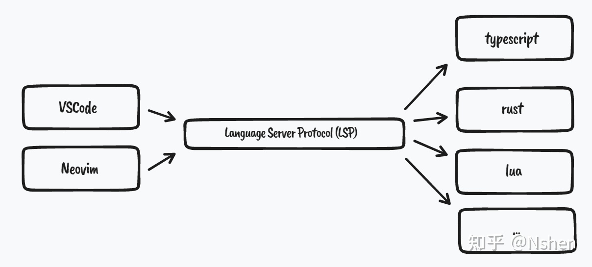

#### Nvim配置文件

> mkdir ~/.config/nvim <br>
  nvim  ~/.config/nvim/init.vim

#### 安装配色主题

> 1.mkdir ~/.config/nvim/colors <br>
 2.下载的配色文件如monokai.vim复制到此文件夹<br>
 3.init.vim中指定主题：colorscheme monokai

#### 安装plug.vim

> mkdir ~/.config/nvim/autoload <br>
 init.vim中配置：
> ```
> call plug#begin('~/.config/nvim/plugApp') //括号里的路径可以根据实际情况设置
> Plug 'junegunn/vim-easy-align'
> call plug#end()
> ```

#### 安装Coc.nvim

> 出现please install dependencies and compile coc.nvim by: yarn install错误解决方法 <br>
 1. npm install -g yarn     安装yarn <br>
 2. 到~/.vim/bundle/coc.nvim的文件目录下执行:yarn install

#### neovim无法获取用户输入解决方法
> ​:te或:terminal 调出终端单独运行该文件
---
### lua配置nvim
#### 什么是 Language Server Protocol ?
> Language Server Protocol (LSP) 是微软为开发工具提出的一个协议， 它将编程工具解耦成了Language Server 与 Language Client 两部分。


Client 专注于页面样式实现， Server 负责提供语言支持，包括常见的自动补全，跳转到定义，查找引用，悬停文档提示等功能。
而我们所说的 Neovim 内置 LSP 就是 client 端的实现，这样我们就可以链接到和 VSCode 相同的 language servers ，实现高质量的语法补全。

#### 安装步骤
1. 安装nvim-lspconfig
2. 安装对应 language server
3. 配置对应语言 require('lspconfig').xx.setup{…}
4. :lua print(vim.inspect(vim.lsp.buf_get_clients())) 查看 LSP 连接状态
```
├── init.lua                              入口文件，这里负责加载所有lua文件夹里的文件
└── lua                                   所有 lua 配置文件
    ├── basic.lua                         Neovim 的基础配置
    ├── keybindings.lua                   快捷键配置
    ├── lsp                               内置 LSP  (Language Server Protocol) 配置
    │   ├── diagnostic_signs.lua
    │   ├── language_servers.lua
    │   └── nvim-cmp-config.lua
    ├── plugin-config                     各个插件配置在这个文件夹
    │   ├── bufferline.lua
    │   ├── comment.lua
    │   ├── nvim-autopairs.lua
    │   ├── nvim-colorizer.lua
    │   ├── nvim-tree.lua
    │   ├── nvim-treesitter.lua
    │   ├── rust-tools.lua
    │   ├── surround.lua
    │   ├── telescope.lua
    │   └── which-key.lua
    └── plugins.lua                        插件安装管理
```

#### map按键映射参数
* \<buffer\> 映射将只局限于当前缓冲区
* \<silent\> 执行键绑定时不在命令行上回显
* \<special\> 一般用于定义特殊键怕有副作用的场合

### vim基础命令
- :version      显示版本及默认vimrc配置文件加载路径
- :scriptnames  按加载顺序显示vim启动后所有script
- :function     查看加载的所有function

### VIM系统变量
#### :echo $HOME       为VIM HOME目录，对应于Linux上的~目录 
> Linux上为/home/username/  <br>
  Windows上为C:\Users\username\   
#### :echo $VIM        为VIM被安装的目录
#### :echo $VIMRUNTIME 为vim.exe程序的目录
#### :echo $MYVIMRC 为用户VIMRC文件路径
> Windows下为\vim\ _vimrc  <br>
  Linux下为~/.vimrc

### VIM环境变量
#### :set all           查看所有环境变量的设置
#### :set               查看所有与系统默认不同的环境变量
#### :set variable?     显示指定环境变量的当前值
#### :set runtimepath?  显示script搜索路径

### 彩蛋
> :smile

### 删除配置和插件
> .config .local .cache

### 查看某个快捷键的详情
> :map 快捷键 (例如 :map <leader>f)

### 技巧篇
1. 重复输入
> 40i 进入insert模式 再输入字符 回到正常模式就重复输入了40遍字符
2. 看某个快捷键的详情
> :map 快捷键 (例如 :map <leader>f)
