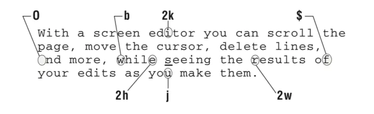

### 一、字符级
| 按键 | 功能 |
|---|-------------|
| h | 向左移动一个字符级单位 |
| l | 向右移动一个字符级单位 |
| j | 向下移动一个字符单位  |
| k | 向上移动一个字符级单位 |

### 二、单词级
| 按键 | 功能 |
|---|-------------|
| w/W | 向 右 移动到下一单词开头 |
| e/E | 向 右 移动到单词结尾 |
| b/B | 向 左 移动到单词开头 |

> **所谓“单词”，是按照英文的书写和使用习惯来定义的。用在中文上，一般就会以标点符号和空格作为“单词”的界限。所以常常是一句话一句话地跳转。**

### 块级(行级)
| 按键 | 功能 |
|---|--------------|
| 0 | 移动到当前行的第一个字符 |
| ^ | 移动到当前行第一个非空白字符 |
| $ | 移动到当前行行尾 |
| + | 移动到下一行的首字母 |
| - | 移动到上一行的首字母 |
| gg | 移动到文档第一行 |
| G | 移动到文档最后一行 |
| H | 移动到当前屏幕的第一行 |
| M | 移动到当前屏幕的中间一行 |
| L | 移动到当前屏幕的最后一行 |
| :<n> 或 <n>gg | 跳转到第 n 行 |
|:+<n> 或 <n>j | 从当前位置向下跳 n 行 |
| :-<n> 或 <n>k | 从当前位置向上跳 n 行 |

### 滚动屏幕
| 按键 | 功能 |
|---|--------------|
| Ctrl-d | 向下滚动半页 |
| Ctrl-u | 向上滚动半页 |
| Ctrl-f | 向下滚动一页 |
| Ctrl-b | 向上滚动一页 |
| z<Enter> | 将当前行滚动到屏幕顶部 |
| z. | 将当前行滚动到屏幕中间 |
| z- | 将当前行滚动到屏幕底部 |

> **绝大部分命令前都可以加一个数字 n ，通常表示对其后的命令连续执行 n 次。所以 3j 可以表示向下移动 3 个字符单位（即下移 3 行）。
3l 表示向右移动 3 个字符单位。相当于连续执行了 l 命令 3 次。
而 9z. 则表示光标移动到第 9 行的同时，滚动屏幕并使得第 9 行位于屏幕中间。（这个 9 的含义不同于 3l 命令中的 3）**

### 文档操作

### 插入编辑
| 按键 | 功能 |
|---|--------------|
| i | 当前字符前插入 |
| I | 当前行首插入 |
| a | 当前字符后插入 |
| A | 当前行尾插入 |
| o | 下一行插入 |
| O | 上一行插入 |

### 删除
| 按键 | 功能 |
|---|--------------|
| x | 删除当前字符（等于 insert 模式下的 Delete） |
| X | 删除前一个字符（等于 insert 模式下的 Backspace） |
| dd | 删除当前行 |
| d<x> | 删除指定内容 |
| cc | 替换整行内容。即将整行内容删除并进入 insert 模式 |
| c<x> | 删除指定内容后，进入 insert 模式。相当于 d<x>a |
| C | 替换当前光标位置到行尾的所有内容。等于 c$ |
> **<x> 部分用于指定删除的范围。
如 j 表示将光标向下移动一个字符单位（即下移一行），则 dj 表示删除当前行和下一行的内容。G 表示将光标移动到文档末尾，则在光标定位在文档首行时，使用 dG 命令可以清空整个文档的内容。**

> **使用以上命令删除的内容会自动保存到 vim 的剪贴板中，即所谓“删除”实际上是“剪切”，使用 p 命令即可粘贴删除的内容。而且该剪贴板限于 vim 内部，不是系统剪贴板。**

### 复制与粘贴
| 按键 | 功能 |
|---|--------------|
| yy | 复制当前内容到 vim 剪贴板 |
| y<x> | 复制指定内容到 vim 剪贴板 |
| p | 在当前位置后粘贴 |
| P | 在当前位置前粘贴 |
| J | 将当前行与下一行内容合并为一行 |
> **y<x> 命令中的 <x> 同样用于指定复制的范围。
如 4j 表示将光标下移 4 行，则 y4j 表示将当前行及其后 4 行内容复制到 vim 剪贴板。8gg 表示将光标定位至第 8 行，则 y8gg 表示复制当前行到第 8 行的所有内容。
当 vim 剪贴板中的内容为整行时，则粘贴命令（p/P）执行时，也会变成在当前行的前（后）一行粘贴。**

### 行级查找
| 按键 | 功能 |
|---|--------------|
| f<x> | 当前行向行尾方向查找并定位到字符 x |
| F<x> | 当前行向行首方向查找并定位到字符 x |
| t<x> | 当前行向行尾方向查找并定位到字符 x 之前 |
| T<x> | 当前行向行首方向查找并定位到字符 x 之后 |
| ; | 继续向当前方向查找下一个字符 |
| , | 继续向当前方向查找下一个字符 |